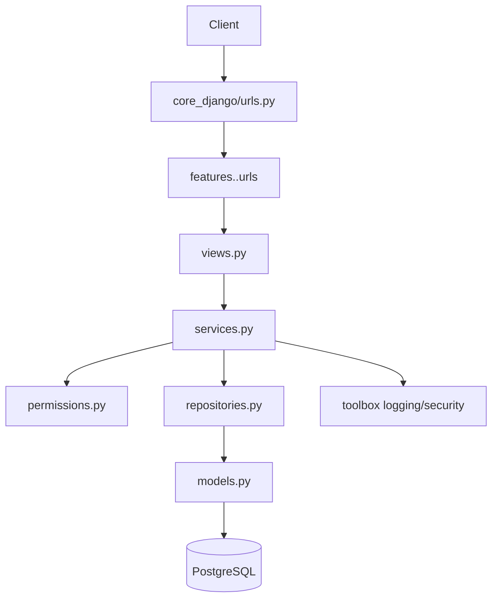

---
aliases:
- Arsitektur Backend
architecture_node: '[[core_django]]'
status: linked_to_code
tags:
- backend
- django
- architecture
title: Backend Architecture
---

# Backend Architecture

Arsitektur backend aktual untuk [[00 - PRD Desa Mandian Gajah]].

> [!info] Status
> Vault ini sekarang disesuaikan ke implementasi kode saat ini, bukan hanya target desain.

## Stack aktual

- Django
- PostgreSQL
- Session auth bawaan Django
- Django Axes untuk proteksi brute force
- Audit log internal via `toolbox.logging`

## Stack target / belum penuh dipakai

- Django Ninja
- Redis
- Celery
- S3/MinIO
- WeasyPrint

## Gaya arsitektur

- Modular monolith berbasis feature
- Layered architecture
- Clean architecture inspired
- RBAC
- Audit-first untuk aksi penting

## Struktur utama

- `core_django/` = composition root: settings, middleware, URL utama
- `features/` = bounded context per modul bisnis
- `toolbox/` = shared cross-cutting concern

## Struktur layer per feature

Pola aktual tiap feature:

- `domain.py` = aturan bisnis murni, constant, exception domain, validator
- `models.py` = model persistence Django ORM
- `repositories.py` = akses data / query ORM
- `permissions.py` = policy otorisasi per feature
- `services.py` = orchestration use case
- `views.py` = adapter HTTP tipis
- `urls.py` = route feature
- `tests/` = verifikasi per layer

> [!note] Catatan penting
> Ini belum pure Clean Architecture. `services.py` masih boleh sentuh objek Django seperti model auth dan kadang `HttpRequest`. Jadi bentuk paling akurat: layered + clean-ish, bukan clean penuh.

## Alur request

## Slice fitur

- [[02 - Modul Auth Warga]]
- [[03 - Modul Profil Wilayah]]
- [[04 - Modul Publikasi Informasi]]
- [[05 - Modul Potensi Ekonomi]]
- [[06 - Modul Layanan Administrasi]]
- [[07 - Modul Pengaduan Warga]]

## Shared concern

- [[08 - Database Schema]]
- [[09 - API Endpoint Plan]]
- [[10 - Backend Roadmap]]
- [[11 - Access Matrix]]
- [[12 - Non-Functional Requirements]]
- [[13 - User Flows]]

## Kondisi implementasi saat ini

- `auth_warga` = modul paling matang, sudah punya domain, repo, service, view, permission, tests
- Modul lain masih dominan scaffold / placeholder
- `toolbox/` sudah dipakai nyata untuk logging, audit, request context, auth helper, permission helper

## Prinsip implementasi

- View tetap tipis, business rule masuk service/domain
- Query ORM sebisa mungkin lewat repository
- Permission global disimpan di `toolbox`, lalu diturunkan di feature
- Fitur boleh pragmatis, tapi batas layer harus tetap jelas dan testable