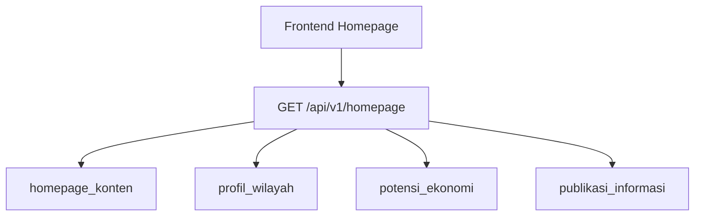

# Homepage Dynamic Backend Feature Plan

> [!abstract]
> Note ini menjelaskan bentuk feature backend jika konten homepage static frontend dipindah menjadi dinamis. Fokus: owner feature tetap bersih, tidak mencampur domain wilayah dengan konten landing page editorial.

## Prinsip utama

> [!success]
> Jangan paksa semua konten homepage ke `[[profil_wilayah]]`.

Karena:

- `profil_wilayah` = data domain desa
- homepage static sekarang = campuran domain + editorial + branding + gallery + CTA

Solusi sehat:

- pertahankan feature lama untuk domain yang memang sudah cocok
- tambah **1 feature baru** untuk konten homepage editorial

## Bentuk feature setelah homepage jadi dinamis

### Tetap dipakai apa adanya

- `[[auth_warga]]`
- `[[dashboard_admin]]`
- `[[layanan_administrasi]]`
- `[[pengaduan_warga]]`

Tidak terkait langsung dengan konten homepage publik, kecuali dashboard untuk admin mengelola data internal.

### Tetap dipakai, tapi jadi sumber data homepage

#### `[[profil_wilayah]]`

Tetap owner untuk:

- identitas desa inti
- visi, misi, sejarah
- dusun
- perangkat desa
- alamat resmi desa
- kemungkinan jam layanan resmi

Dipakai homepage untuk:

- nama desa
- deskripsi desa dasar
- statistik wilayah tertentu
- alamat dan identitas resmi

#### `[[potensi_ekonomi]]`

Tetap owner untuk:

- unit usaha desa
- wisata desa
- data ekonomi published

Dipakai homepage untuk:

- potensi ekonomi
- daftar usaha/wisata unggulan
- CTA ekonomi desa

#### `[[publikasi_informasi]]`

Tetap owner untuk:

- berita
- pengumuman

Dipakai homepage untuk:

- berita terbaru
- pengumuman terbaru

## Feature baru yang disarankan

### `homepage_konten`

> [!note]
> Ini feature baru untuk semua konten yang sifatnya editorial / branding / landing-page-specific.

Owner field:

- `tagline`
- `heroImage`
- `heroBadge`
- `brand.*`
- `naming*`
- `culture*`
- `sialang*`
- `peat*`
- `recoveryItems`
- `facilities*`
- `gallery`
- `footerLinks`
- `footerDescription`
- `footerBadges`
- `footerCopyright`
- statistik homepage manual seperti `RW`, `RT`, `Jiwa`, `KK`, `Ha Gambut`, `Embung`

## Struktur feature baru yang disarankan

```txt
features/
└── homepage_konten/
    ├── api.py
    ├── schemas.py
    ├── services.py
    ├── domain.py
    ├── repositories.py
    ├── models.py
    ├── permissions.py
    └── tests/
```

## Bentuk arsitektur final



## Dua opsi implementasi

### Opsi A — Bersih dan ideal

Tambahkan:

- feature `homepage_konten`
- endpoint agregat `GET /api/v1/homepage`

Payload homepage:

- `identity` dari `[[profil_wilayah]]`
- `landing_content` dari `homepage_konten`
- `potentials` dari `[[potensi_ekonomi]]`
- `latest_publications` dari `[[publikasi_informasi]]`

Kelebihan:

- owner data jelas
- frontend dapat 1 payload
- scaling lebih enak

### Opsi B — Migrasi bertahap

Tetap static dulu untuk editorial block, backend hanya untuk:

- profil desa
- potensi ekonomi
- publikasi

Lalu tahap berikut tambah `homepage_konten`.

Kelebihan:

- implementasi lebih cepat
- risiko lebih kecil

Kekurangan:

- frontend tetap campur static + dynamic

## Rekomendasi final

> [!success]
> Feature set paling sehat kalau homepage jadi dinamis:
>
> - `[[profil_wilayah]]` tetap untuk domain desa
> - `[[potensi_ekonomi]]` tetap untuk ekonomi/wisata
> - `[[publikasi_informasi]]` tetap untuk berita/pengumuman
> - tambah `homepage_konten` untuk semua blok editorial homepage
> - tambah endpoint agregat `homepage`

## Status implementasi aktual

> [!success]
> Status codebase saat ini:
>
> - feature `homepage_konten` sudah dibuat
> - endpoint publik `GET /api/v1/homepage` sudah ada
> - endpoint admin untuk update singleton dan CRUD child section sudah ada
> - `homepage_konten` sudah terhubung ringan ke `[[dashboard_admin]]`

Integrasi `[[dashboard_admin]]` yang sudah ada:

- `content health` menampilkan status homepage
- hitung `filled / empty / total sections`
- hitung `homepage completeness score` dalam persen
- flag section penting yang masih kosong
- recent activity memuat perubahan homepage
- quick action `kelola-homepage`
- statistik homepage manual sekarang bisa di-CRUD via admin API

Section penting homepage yang dipantau di dashboard:

- `village_name`
- `tagline`
- `hero_image`
- `hero_description`
- `contact_address`
- `naming_title`
- `culture_title`
- `sialang_title`
- `peat_title`
- `facilities_title`
- `footer_description`
- list penting:
  - `culture_cards`
  - `facilities`
  - `gallery`
  - `footer_links`

## Yang jangan dilakukan

> [!danger]
> Jangan:
>
> - gabungkan semua ke `profil_wilayah`
> - buat feature terpisah kecil seperti `hero`, `gallery`, `footer`
> - campur data domain dengan copywriting landing page

## Referensi

- [[14 - Homepage Data Mapping]]
- [[01 - Backend Architecture]]
- [[03 - Modul Profil Wilayah]]
- [[04 - Modul Publikasi Informasi]]
- [[05 - Modul Potensi Ekonomi]]
- [[profil_wilayah]]
- [[publikasi_informasi]]
- [[potensi_ekonomi]]
